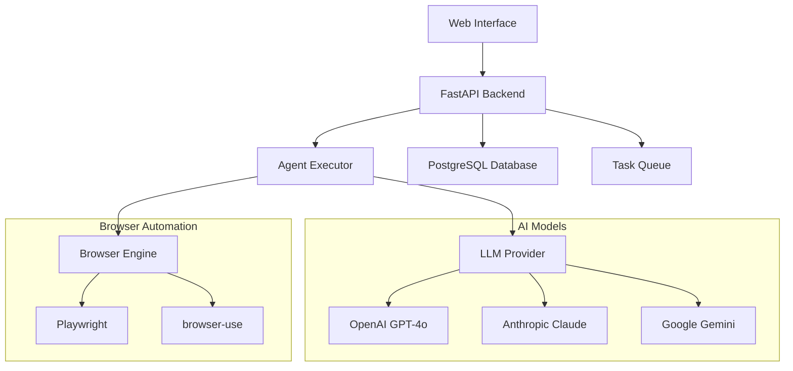

# Browser Agents - AI Browser Automation Platform

Browser Agents is a web platform that lets you create, deploy, and manage AI-powered browser automation agents. Build intelligent bots that can navigate websites, extract data, fill forms, and perform complex web tasks using natural language instructions.


[](https://opensource.org/licenses/Apache-2.0)
[](https://python.org)
[](https://reactjs.org)
[](https://fastapi.tiangolo.com)
[](https://docker.com)
[](CONTRIBUTING.md)

[🚀 Quick Start](#-quick-start) • [📖 Documentation](#-documentation) • [🎯 Features](#-key-features) • [🤝 Contributing](#-contributing) • [💬 Community](#-community--support)


## ✨ Key Features

<table>
<tr>
<td width="50%">

### 🎨 **No-Code Agent Builder**
- Visual drag-and-drop interface
- Natural language task descriptions
- Pre-built templates for common use cases
- Smart configuration recommendations

### 🧠 **Multi-Model AI Support**
- OpenAI GPT-4o, GPT-4 Turbo
- Anthropic Claude 3.5 Sonnet, Claude 3 Opus
- Google Gemini Pro
- Custom model configurations

</td>
<td width="50%">

### 📊 **Enterprise Dashboard**
- Real-time execution monitoring
- Performance analytics & insights
- Detailed execution logs with screenshots
- Team collaboration & user management

### 🔌 **Developer APIs**
- RESTful API with OpenAPI docs
- Webhook integrations
- API key management
- SDK support (Python, JavaScript)

</td>
</tr>
</table>

### 🚀 **Advanced Capabilities**

- **Visual Understanding**: Agents can see and interact with web pages like humans
- **Context Memory**: Maintains state across complex multi-step workflows
- **Error Recovery**: Smart retry mechanisms and failure handling
- **Parallel Execution**: Run multiple agents simultaneously
- **Data Export**: CSV, JSON, Excel export formats

## 🏗️ Architecture



## 🚀 Quick Start

### Prerequisites

- **Docker & Docker Compose** (recommended)
- **Python 3.11+** (for local development)
- **Node.js 18+** (for frontend development)
- **PostgreSQL 13+** (if not using Docker)

### 🐳 Docker Installation (Recommended)

Get up and running in under 5 minutes:

```bash
# 1. Clone the repository
git clone https://github.com/daviddaytw/browser-agents.git
cd browser-agents

# 2. Configure environment
cp .env.example .env
# Edit .env with your settings (see Configuration section below)

# 3. Start all services
docker compose up -d

# 4. Access the platform
open http://localhost:5173
```

### 🛠️ Local Development Setup

For development or customization:

<details>
<summary>Click to expand local setup instructions</summary>

```bash
# Backend setup
cd backend
python -m venv .venv
source .venv/bin/activate  # On Windows: .venv\Scripts\activate
pip install uv
uv sync
uv run alembic upgrade head
uv run uvicorn app.main:app --reload --port 8000

# Frontend setup (new terminal)
cd frontend
npm install
npm run generate-client
npm run dev
```

</details>

## API Usage

### Python
```python
import requests

# Create agent
response = requests.post(
    "http://localhost:8000/api/v1/agents",
    headers={"Authorization": "Bearer your_api_key"},
    json={
        "name": "Data Extractor",
        "task_prompt": "Extract all product names and prices from {url}",
        "llm_model": "claude-3-5-sonnet"
    }
)

agent_id = response.json()["id"]

# Execute agent
execution = requests.post(
    f"http://localhost:8000/api/v1/agents/{agent_id}/execute",
    headers={"Authorization": "Bearer your_api_key"},
    json={
        "parameters": {
            "url": "https://example-store.com/products"
        }
    }
)

print(f"Execution ID: {execution.json()['id']}")
```

### JavaScript/Node.js

```javascript
const axios = require('axios');

const client = axios.create({
  baseURL: 'http://localhost:8000/api/v1',
  headers: { 'Authorization': 'Bearer your_api_key' }
});

// Execute agent
const execution = await client.post(`/agents/${agentId}/execute`, {
  parameters: { url: 'https://example.com' }
});

console.log('Execution started:', execution.data.id);
```

## 🛡️ Security & Compliance

- **🔐 Secure Authentication**: JWT-based authentication with API key management
- **🔒 Data Encryption**: All data encrypted in transit (TLS) and at rest
- **🛡️ Input Validation**: Comprehensive input sanitization and validation
- **📊 Audit Logging**: Complete audit trail of all actions and changes
- **🏢 Enterprise Ready**: GDPR compliant with enterprise security features
- **🔑 Role-Based Access**: Granular permissions and user management
- **🚫 Rate Limiting**: API rate limiting and abuse prevention

## 🤝 Contributing

We welcome contributions from the community! Whether you're fixing bugs, adding features, or improving documentation, your help makes Browser Agents better for everyone.

### 🚀 Quick Contribution Guide

1. **Fork** the repository
2. **Create** a feature branch (`git checkout -b feature/amazing-feature`)
3. **Commit** your changes (`git commit -m 'Add amazing feature'`)
4. **Push** to the branch (`git push origin feature/amazing-feature`)
5. **Open** a Pull Request

### 📋 Development Setup

```bash
# Install development dependencies
cd backend && uv sync --dev
cd frontend && npm install

# Run tests
cd backend && uv run pytest
cd frontend && npm test

# Code formatting
cd backend && uv run ruff format .
cd frontend && npm run lint
```

### 🎯 Ways to Contribute

- 🐛 **Report Bugs**: Help us identify and fix issues
- 💡 **Suggest Features**: Share ideas for new functionality  
- 📝 **Improve Documentation**: Help others understand the platform
- 🔧 **Submit Code**: Fix bugs or add new features
- 🎨 **Design & UX**: Improve the user interface and experience

**👉 [Read our detailed Contributing Guide](CONTRIBUTING.md)**

## ❓ FAQ

<details>
<summary><strong>What makes Browser Agents different from other automation tools?</strong></summary>

Browser Agents combines the power of large language models with browser automation, allowing you to describe tasks in natural language rather than writing complex scripts. It's designed for both technical and non-technical users.

</details>

<details>
<summary><strong>Which AI models are supported?</strong></summary>

We support OpenAI (GPT-4o, GPT-4 Turbo), Anthropic (Claude 3.5 Sonnet, Claude 3 Opus), Google (Gemini Pro), and custom model configurations. You can choose the best model for each specific task.

</details>

<details>
<summary><strong>Is there a free tier available?</strong></summary>

Yes! The open-source version is completely free. You only pay for the AI model API usage (OpenAI, Anthropic, etc.) and any cloud hosting costs if you choose to deploy it.

</details>

<details>
<summary><strong>Can I run this on-premises?</strong></summary>

Absolutely! Browser Agents is designed to run on-premises or in your private cloud. All data stays within your infrastructure.

</details>

<details>
<summary><strong>How do I handle websites that require authentication?</strong></summary>

Browser Agents supports various authentication methods including cookies, session storage, and form-based login. You can configure authentication steps as part of your agent's workflow.

</details>

## 📄 License

Browser Agents is open source software licensed under the [Apache License 2.0](LICENSE).

## 🙏 Acknowledgments

Browser Agents is built on the shoulders of giants. Special thanks to:

- **[browser-use](https://github.com/browser-use/browser-use)** - The core browser automation library that powers our agents
- **[FastAPI](https://fastapi.tiangolo.com/)** - Modern, fast Python web framework for building APIs
- **[React](https://reactjs.org/)** - A JavaScript library for building user interfaces

---

<div align="center">

**Made with ❤️ by the Browser Agents community**

[⭐ Star us on GitHub](https://github.com/daviddaytw/browser-agents) • [🐛 Report Issues](https://github.com/daviddaytw/browser-agents/issues)

</div>
